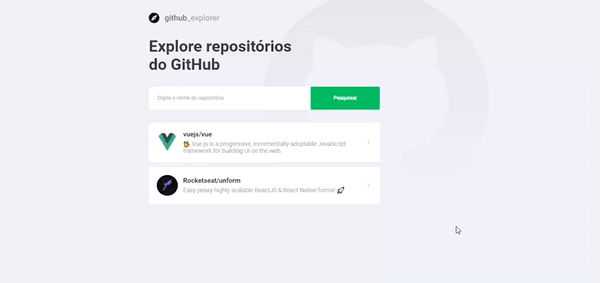

# Github Explorer
Este mini projeto foi realizado com objetivo de estudo. É basicamente para buscar repositórios do GitHub, contendo validação de dados e consumindo
 a api gratuita do próprio.

### Preview

<h1 align="center">
  
</h1>

### Recursos 
- [x]  ReactJS, Typescript e styled-components

### Como acessar?
- Abra a pasta do projeto no VSCode
- Abra o terminal e digite `npm install` para instalaar as dependências do projeto
- Após a instalação, ainda no terminal digite `npm start` para iniciar o projeto
- Acesse o endereço gerado no Browser 🚀
